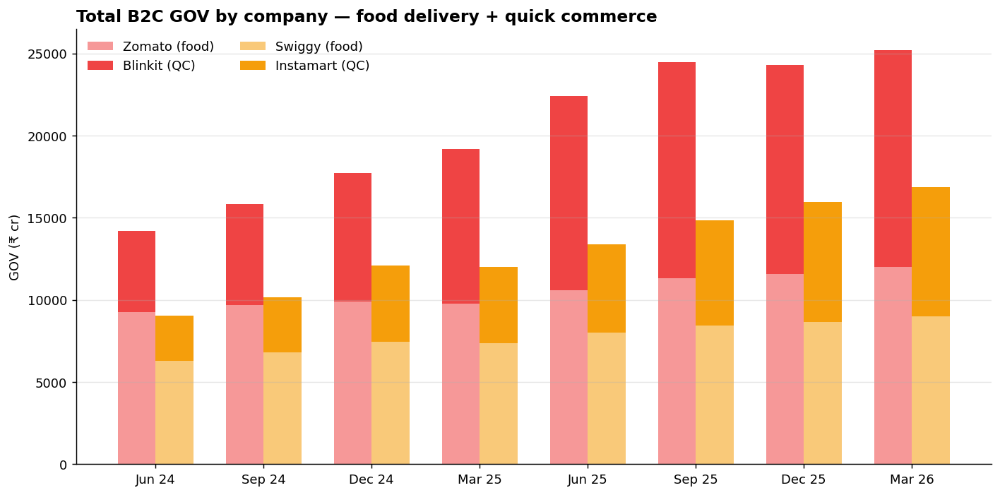

# Zomato vs. Swiggy: Two Bets, One Industry

> A self-directed analytics project. 8 quarters of data, two companies, two business lines. The food delivery race has converged. The strategic divergence is hiding in the second bet.



**The non-obvious finding:** Zomato and Swiggy's food delivery businesses are now *operationally identical* — same growth rate, same margin (3.4% vs 3.3% EBITDA margin in Q4 FY26). The entire competitive divergence between these two companies is happening inside quick commerce: Blinkit vs Instamart. Anyone analyzing "Zomato vs Swiggy" by looking only at food delivery is reading the wrong dashboard.

---

## Why this project

I'm transitioning from QA to data analytics. This repo is a portfolio piece — proof that I can frame a strategic question, source public data, run analysis, and arrive at a finding I can defend.

The starting question:

> *Everyone says "Zomato vs Swiggy" as if they're still in the same race. Are they? What does the public data actually show?*

The short answer: **same race in food delivery, completely different race in quick commerce, and the second race is where the money is going.**

## New here? Start with the walkthrough

If this is your first time looking at this project — including if you're me, the author, opening it for an interview prep session — read [`WALKTHROUGH.md`](./WALKTHROUGH.md). It explains the entire project end-to-end: the structure, the findings, how to run everything, how to talk about it, and what to put on a resume.

There are five documentation files in this repo, each with a different purpose:

- **`WALKTHROUGH.md`** — the complete project tour, 11 sections covering everything
- **`METHODOLOGY.md`** — how the analysis was actually built, step by step; the thinking behind every choice
- **`INTERVIEW_PREP.md`** — study sheet for interviews; questions and ready answers
- **`GITHUB_SETUP.md`** — copy-paste guide to publish this project as a live website
- **`analysis.md`** — the full written argument with all three findings unpacked

Plus [`data/SOURCES.md`](./data/SOURCES.md), which documents every data source and every estimate.

## What's in this repo

```
zomato-vs-swiggy-teardown/
├── README.md                          ← you are here
├── WALKTHROUGH.md                     ← complete tour of the project
├── METHODOLOGY.md                     ← how the analysis was built, step by step
├── INTERVIEW_PREP.md                  ← study sheet for interviews
├── GITHUB_SETUP.md                    ← copy-paste guide to get it live
├── analysis.md                        ← full write-up with findings + caveats
├── index.html                         ← the dashboard (root copy, for GitHub Pages)
├── data/
│   ├── food_delivery_quarterly.csv    ← 16 rows: Zomato + Swiggy food delivery
│   ├── quick_commerce_quarterly.csv   ← 16 rows: Blinkit + Instamart
│   └── SOURCES.md                     ← citations, estimation notes, caveats
├── notebooks/
│   └── 01_zomato_vs_swiggy_analysis.ipynb  ← reproducible Python analysis
├── sql/
│   └── analysis.sql                   ← same analysis in DuckDB SQL
├── dashboard/
│   └── index.html                     ← standalone static dashboard (Chart.js)
├── docs/images/                       ← 6 chart PNGs
├── requirements.txt
├── LICENSE
└── .gitignore
```

## A note on names

Indian financial press makes this confusing:

- **Zomato Ltd renamed itself to Eternal Ltd in March 2025.** Eternal is the listed parent. NSE ticker: ETERNAL.
- Eternal owns four businesses: **Zomato** (food delivery app), **Blinkit** (quick commerce), **Hyperpure** (B2B restaurant supply), **District** (going-out).
- Swiggy Ltd owns: **Swiggy** (food delivery app), **Instamart** (quick commerce), **Dineout**, **Genie**, **Scenes**.

This project compares the two B2C businesses that compete head-to-head: food delivery (Zomato app vs Swiggy app) and quick commerce (Blinkit vs Instamart). Where I reference parent-company financials, I use "Eternal" and "Swiggy Ltd."

## The three findings (TL;DR)

### Finding 1 — Food delivery margins have fully converged

In Q1 FY25, Zomato's food delivery EBITDA margin was 2.5% vs Swiggy's 0.2% — a 2.3pp lead. By Q4 FY26, it's 3.4% vs 3.3% — a 0.1pp lead. Swiggy caught up entirely. Both businesses now grow at 22–23% YoY and earn the same margin. **As products, they're commodities to each other.**

### Finding 2 — Quick commerce is where the divergence lives

Blinkit's GOV is 1.68× Instamart's and the absolute gap widens every quarter. Blinkit has positive contribution margin (+3.5%); Instamart is still negative (-1.8%). But here's the twist: **the gap is narrowing.** Instamart improved unit economics by 4.0pp in 8 quarters; Blinkit by only 1.1pp. Instamart is moving 3.6× faster — from below the waterline.

### Finding 3 — Eternal is becoming a quick commerce company; Swiggy isn't

In Q4 FY26, **52% of Eternal's B2C GOV is Blinkit** — quick commerce passed food delivery as the larger business. At Swiggy, food delivery is still 53% of B2C GOV. Same starting point, very different end state. The "second bet" became the main bet at one of these companies, not the other.

Full reasoning, charts, and caveats in [`analysis.md`](./analysis.md).

## Three ways to read this repo

### 1. The dashboard — 90 seconds
Open `dashboard/index.html` in any browser. No build step, no server. Static HTML + Chart.js.

### 2. The notebook — 10 minutes
`notebooks/01_zomato_vs_swiggy_analysis.ipynb` — full Python analysis. Runs in Colab or locally:

```bash
pip install -r requirements.txt
jupyter notebook notebooks/01_zomato_vs_swiggy_analysis.ipynb
```

### 3. The SQL — for the SQL-fluent
`sql/analysis.sql` — same analysis in DuckDB SQL, queries the CSVs directly:

```bash
pip install duckdb
duckdb -c ".read sql/analysis.sql"
```

## Methodology

- **Sources:** Eternal investor decks (Q1 FY25 → Q4 FY26), Swiggy DRHP + post-IPO investor decks, NSE/BSE filings, brokerage notes (ICICI Securities, Jefferies, Goldman Sachs), trade press (Inc42, Entrackr, Business Standard).
- **Period:** 8 quarters, Apr 2024 – Mar 2026.
- **Currency:** ₹ crore (1 crore = 10 million ≈ $120K USD).
- **Caveats:** Detailed in [`data/SOURCES.md`](./data/SOURCES.md). A few cells are best-fit estimates where the company didn't disclose the exact figure in a quarter — flagged in the `source_tag` column.

## The QA-to-analytics angle

Two QA muscles that translate directly to analytics:

- **Edge-case skepticism** — any number that looks too clean usually isn't. I flag QoQ dips, definitional inconsistencies, and metric reframings throughout.
- **Failure-mode thinking** — for each trend, ask: what would have to be true for this to reverse? That section sits at the bottom of `analysis.md`.

These showed up concretely in dataset assembly:

- Both companies' AOV definitions changed mid-period (platform-fee inclusion). Without flagging, the AOV chart would show a sudden spike that's actually a definitional artifact.
- Instamart's Q4 FY25 GOV looked like a typo at first (sequential decline). It turned out to be a deliberate growth pause to consolidate dark store buildout — confirmed via investor call transcripts.

## What I'd build next

Three follow-up analyses I'd run with internal data access:

1. **Cohort retention curves** — does a Q1 FY25 user still order in Q4 FY26?
2. **SKU-mix contribution split** — which categories drive QC margin improvement?
3. **Tier 1 vs Tier 2 store P&L** — at what stage does a Tier 2 dark store turn contribution-positive?

## License

MIT. Use the data and code freely. If you republish the analysis, a link back is appreciated but not required.

## About

Built by Jaskirat Kaur · linkedin.com/in/jaskirat-kaur-23 · Finding signal in public data since before it was obvious.
